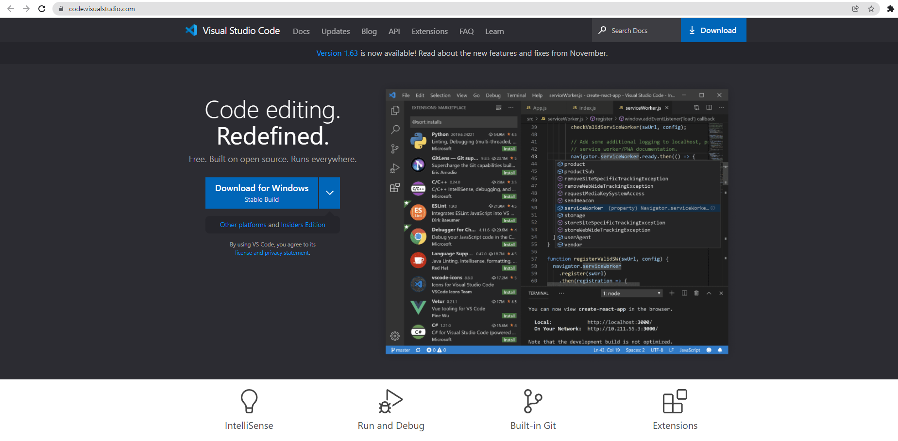
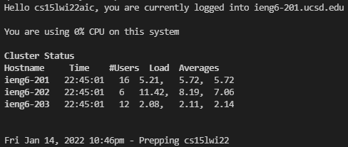
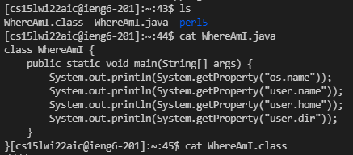
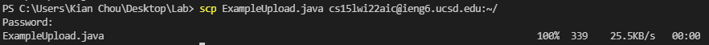
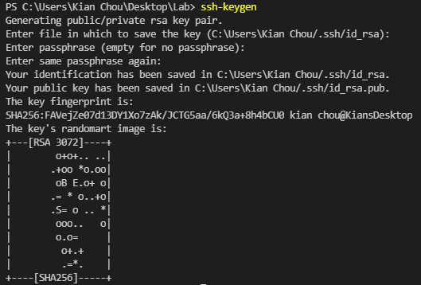
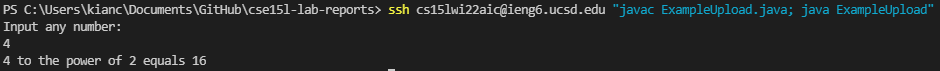

# Lab 1 - Remote Access

In this first lab. we learned about the basics of using console commands and logging in to our CSE15L accounts on the UCSD server.

## Step 1: Installing VScode

First off, you will want to download and install Visual Studio Code, or VScode for short. Head on over to the [Visual Studio Code Website](https://code.visualstudio.com/) and click the download button.



## Step 2: Remotely Connecting

For this step, you first need to download OpenSSH by going through the tutorial in the following link: [OpenSSH](https://docs.microsoft.com/en-us/windows-server/administration/openssh/openssh_install_firstuse)

Go to the following website to obtain your CSE15L account:

[https://sdacs.ucsd.edu/~icc/index.php](https://sdacs.ucsd.edu/~icc/index.php)

Then, open the console in VScode and type out the following command:

```
ssh cs15lwi22###@ieng6.ucsd.edu
```

Replace the ### with whatever your CSE15L account is that you found from the previous website. After this, it will prompt you to enter your password. After this, you should be logged in.



## Step 3: Trying Some Commands

Here is a list of some of the basic commands and what they do

- cd - changes the current directory
- ls - lists out the contents in the current directory
- cp - used to copy a file
- cat - reads out a file



## Step 4: Moving Files with scp

In order to move a file over with scp, you would need to run the command:

```
scp filename cs15lwi22###@ieng6.ucsd.edu:~/
```

replace the (filename) with the name of the file, followed by its' extention. Also make sure to replace the ### with your CSE15L account name.



## Step 5: Setting an SSH Key

First, begin by creating an ssh key on your own device. This can be done by first typing the command:
```
ssh-keygen
``` 
in your terminal. The output should look something like this when you go through the steps.



After this is done, log back into the server. On the server, type in the command:
```
mkdir .ssh
```
Log out once this is completed. Then, using what we learned from last step, scp the file we just created for the public key to the server. This can be done with the following command:
```
scp FileLocation cs15lwi###@ieng6.ucsd.edu:~/.ssh/authorized_keys
```
Make sure to replace FileLocation with the location that you saved your public key. Again, also make sure to change the ### with your CSE15L login.

## Step 6: Optimizing Remote Running

Optimizing remote running can be done by inputting multiple commands into the command line at once. Since we do not need a password to login anymore, we can now run multiple commands without needing to interfere. For example, if I wanted to compile and run the file ExampleUpload that I uploaded in part 4, I can run the following command:
```
ssh cs15lwi22###@ieng6.ucsd.edu "javac ExampleUpload.java; java ExampleUpload"
```
Here is an image of me running the above command



