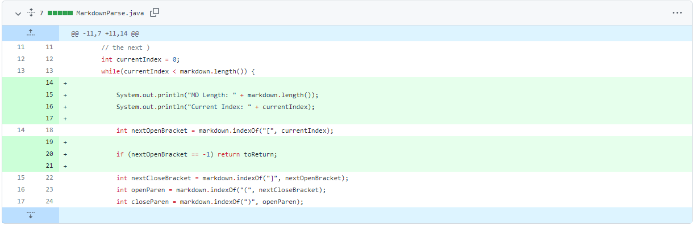
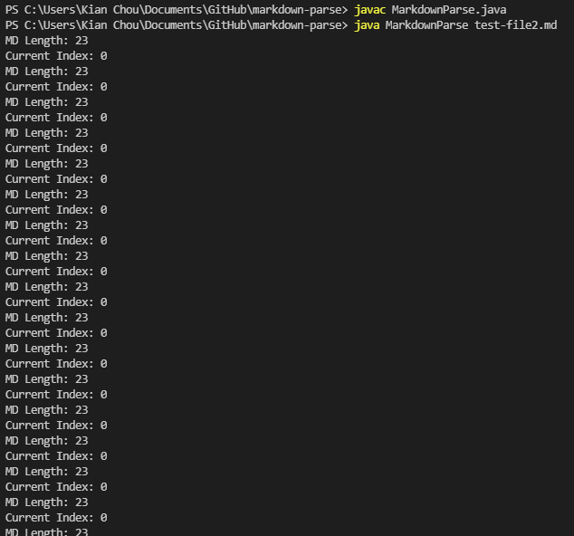

# Lab 2 - Remote Access

## Example 1
Link to failure-inducing input:
[test-file2.md](lab-2-test-files/test-file2.md)

Screenshot of the code change:

Screenshot of the symptom:

^^^ (Infinite Loop)

The bug was that when the markdown file had no open or closed brackets or parenthesis, the code would keep running and looking for these characters in the input file without ever ending. The symptom was that our print statements would keep repeatedly printing out, and our current index stayed at 0. In order to fix this, we added a check to see if searching for the index of the brackets and parenthesis was -1, because this would mean that there were none of these in the file.

---
## Example 2
Link to failure-inducing input:
[test-file3.md](lab-2-test-files/test-file3.md)

Screenshot of the code change:

Screenshot of the symptom:

This bug was that the images were also being counted as valid links, and were being returned in the resulting arraylist. The symptom was that the image that we included in test-file3.md also got printed out by our code. This was fixed by adding a checker for an "!" before the opening bracket, and ignoring those that had the exclamation mark.

---

## Example 3
Link to failure-inducing input:
[test-file8.md](lab-2-test-files/test-file8.md)

Screenshot of the code change:

Screenshot of the symptom:

The bug was that invalid links that contained spaces in them were also being counted as links themselves, and therefore was being outputted by the program. The symptom was that during our JUnit tests, the test for test-file8.md didn't return the expected output of an empty arraylist. Therefore, we had to add a check to see if there were any spaces between the two parenthesis in order to determine if the link was valid.