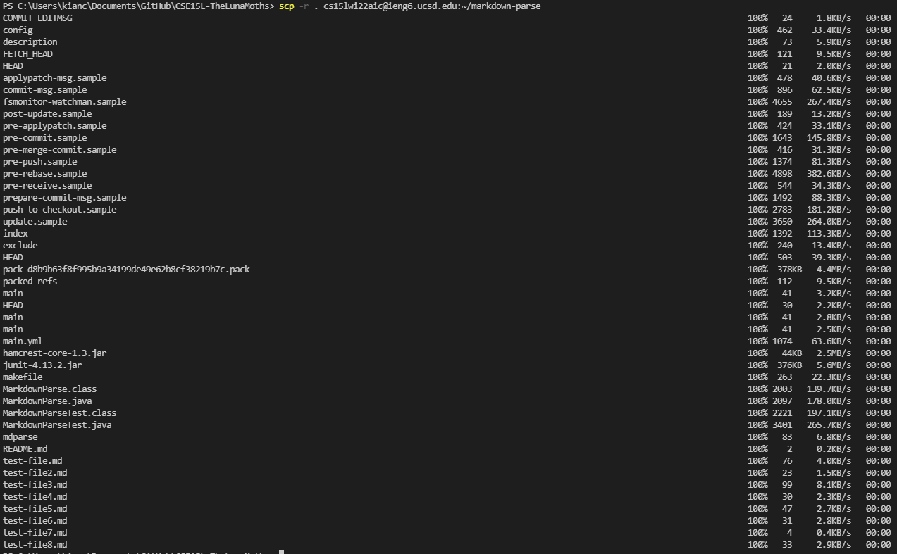
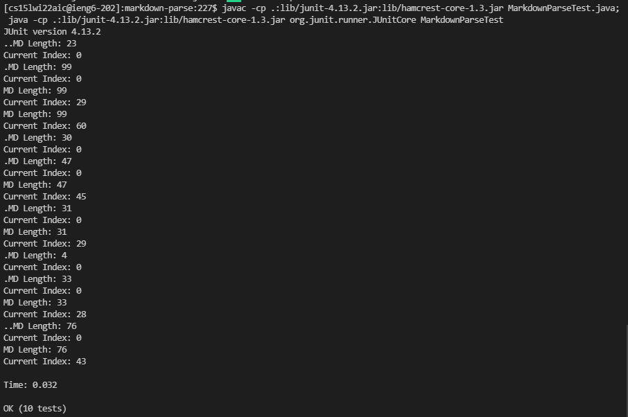
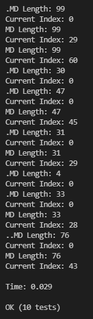

# Lab Report 3 - Copy whole directories

## Step 1 - Copying the directory

You can use the `scp -r` command to copy entire directories and the contents within that directory.

`scp -r . cs15lwi22###@ieng6.ucsd.edu:~/markdown-parse`

Make sure to replace the ### with your CSE15L account.

This is how it looked when I ran the scp -r command from my computer.

When running the scp -r command, you can also specify the types of files you want to copy. For example, if I only wanted to copy the .java and .md files, and the lib directory to the ieng6 server, I would run the following command.

`scp -r *.java *.md lib/ cs15lwi22aic@ieng6.ucsd.edu:markdown-parse`

## Step 2 - Testing the directory on ieng6

Now when I ssh into the ieng6 server, I can go to the new markdown-parse directory that I created and run the tester file there. Here is me doing it on my CSE15L account.

## Step 3 - Copying and Running

Now to make things easier, we can combine the scp command with the commands used to login and run the tester on the server all into one line. So if I wanted to copy just the .java and .md files, as well as the libs folder, into the remote markdown-parse directory, and then remotely run the tester on the ieng6 server, I would run the following command:

`scp -r *.java *.md lib/ cs15lwi22aic@ieng6.ucsd.edu:markdown-parse; ssh cs15lwi22aic@ieng6.ucsd.edu "cd markdown-parse; javac -cp .:lib/junit-4.13.2.jar:lib/hamcrest-core-1.3.jar MarkdownParseTest.java; java -cp .:lib/junit-4.13.2.jar:lib/hamcrest-core-1.3.jar org.junit.runner.JUnitCore MarkdownParseTest"`

Quite a long command, but here is the result of what happens when I do this:

