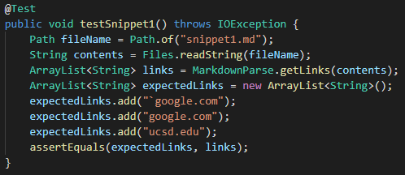
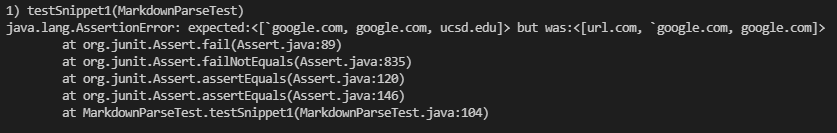
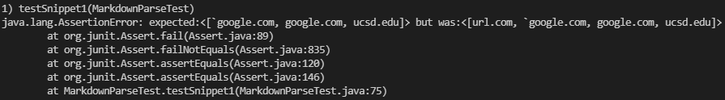
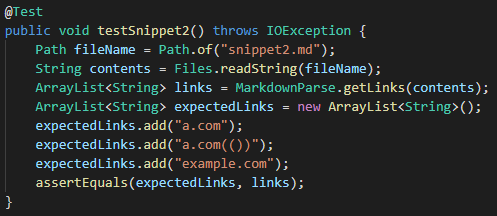
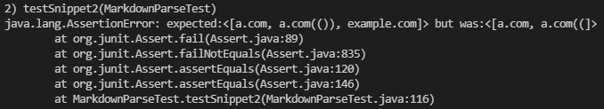
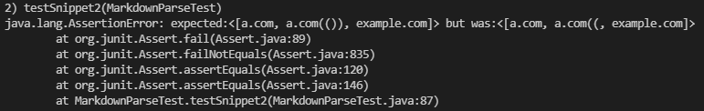
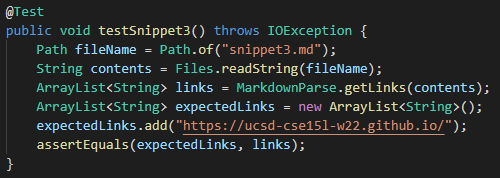
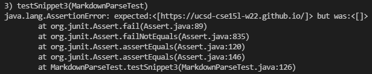
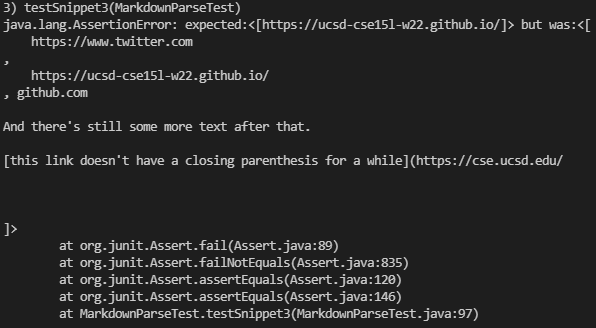

# Lab Report 4

### [My Markdown Parse Directory](https://github.com/kjchou324/CSE15L-TheLunaMoths)

### [Reviewed Markdown Parse Directory](https://github.com/yaz067/markdown-parse)

## Snippet 1
Source
```md
`[a link`](url.com)

[another link](`google.com)`

[`cod[e`](google.com)

[`code]`](ucsd.edu)
```
Expected Links: `google.com, google.com, ucsd.edu

Snippet 1 Test in MarkdownParseTes.java  


Outcome of test for my implementation: Failure  


Outcome of test for reviewed implementation: Failure  


For my own implementation, I think there is a possible small code change that will make my program work for snippet 1 and cases with the inline code backticks. Since inline ticks only work for single lines, I would need a counter to check if there is an open inline tick outside of the url and before it. Then I would check that if there is another inline tick inside, then to not count that link. This would work for the code where both the backticks inside the url since the first backtick is counted as inside the url.

---
## Snippet 2
Source
```md
[a [nested link](a.com)](b.com)

[a nested parenthesized url](a.com(()))

[some escaped \[ brackets \]](example.com)
```
Expected Links: a.com, a.com(()), example.com

Snippet 2 Test in MarkdownParseTes.java  


Outcome of test for my implementation: Failure  


Outcome of test for reviewed implementation: Failure  


For these types of cases, I think there is a small code change that can make my program work for snippet 2 and cases that nest parentheses, brackets, and escaped brackets. First for the escaped brackets, I would need to check if theres a backslash before it, and if there is then to ignore that bracket. For the nested parentheses, it seems like links must have the same number of opened an closed parentheses. So for the link part, I would need to have a checker to see if there is the same number of opened and closed parentheses inside the main link's parenthesis, and if there is then to count it as a valid link. For the nested brackets, I would also need to check if there is an open bracket after the first found open bracket, and if there is then to use that index instead of the first found one.

---
## Snippet 3
Source
```md
[this title text is really long and takes up more than 
one line

and has some line breaks](
    https://www.twitter.com
)

[this title text is really long and takes up more than 
one line](
    https://ucsd-cse15l-w22.github.io/
)


[this link doesn't have a closing parenthesis](github.com

And there's still some more text after that.

[this link doesn't have a closing parenthesis for a while](https://cse.ucsd.edu/


)

And then there's more text
```
Expected Links: https://ucsd-cse15l-w22.github.io/

Snippet 3 Test in MarkdownParseTes.java  


Outcome of test for my implementation: Failure  


Outcome of test for reviewed implementation: Failure  


This one is a bit tricky since here, there are spaces within the parentheses but not within the actual link itself, so it still counts the cse15l link as a valid link. However, I do think there is a small code change that will make my program work for this snippet as well as cases that have newlines in brackets and parentheses. Since new lines are allowed between the brackets and parenthesis, but not empty new lines, I would just need to check if there is an empty line within the bracket or the parenthesis. For spaces within the link, I would need to check if between the first non-space character and the last non-space character contains any spaces.