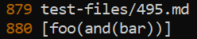
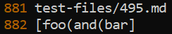
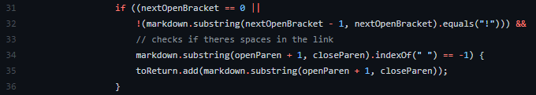
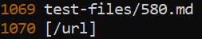
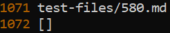
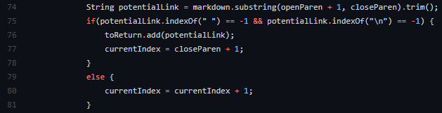

# Lab Report 5

## Finding the test differences

After writing and running the script to print the output and test file name for each test and write it into the file results.txt, I was then ready to compare the results of both my implementation and the given implementation by using the `diff` command. Here is the full output of when I used the diff command on the given markdown parse results and my markdown parse's results:

```
212c212
< [url]
---
> []
230c230
< [baz]
---
> []
866c866,867
< []
---
> [foo
> bar]
870c871,872
< []
---
> [<foo
> bar>]
878c880
< [\(foo\)]
---
> [\(foo\]
880c882
< [foo(and(bar))]
---
> [foo(and(bar]
882c884
< []
---
> [foo(and(bar]
884c886
< []
---
> [foo\(and\(bar\]
886c888
< []
---
> [<foo(and(bar]
916c918
< [/uri]
---
> []
918c920
< [/uri]
---
> []
920c922
< [/uri]
---
> []
934c936
< [uri1]
---
> []
1054c1056
< [/url]
---
> []
1056c1058
< [/url]
---
> []
1062c1064
< [train.jpg]
---
> []
1066c1068
< [<url>]
---
> []
1070c1072
< [/url]
---
> []
```
As seen, there were quite a few differences with the lines. I assume that some of the results ended up including line breaks, hence why near the end they are comparing different lines. In order to find which tests these lines were associated with, I entered both result.txt files through the `vim` command and used the vim command `:set number` to show the line numbers. Next, I will identify which test cases I used by displaying the test's result from the diff command, the results.txt file for both implementations, and the actual test itself.

---

## Test Case 1

```
880c882
< [foo(and(bar))]
---
> [foo(and(bar]
```
Snippet from results.txt (given implementation)



Snippet from results.txt (my implementation)



495.md contents
```md
[link](foo(and(bar)))
```

From looking at the VSCode preview, it says that this is a valid link and the link sshould be "foo(and(bar))". Therefore, the given implementation was correct on this part. I think the bug here is that my implementation doesn't account for open and closed parenthesis inside of the actual link, which is written between the parenthesis in markdown. Therefore, I would probably want to add a counter for open and closed parenthesis in between the parenthesis of the link because links with unbalanced open and closed parenthesis don't count as valid links. This is where I would add this fix:



Inside this if statement, I could add a loop to run through the substring between the parenthesis, counting the number of open and closed parenthesis. If they equal to each other at the end, I would then add it to the arraylist, and avoid it otherwise.

---

## Test Case 2

```
1070c1072
< [/url]
---
> []
```

Snippet from results.txt (given implementation)



Snippet from results.txt (my implementation)  



580.md contents
```md

```

From just looking at this test, since it has the exclamation mark before it, that would mean it is an image rather than a link. Therefore, for this test, I think that my implementation was corrent on this part. The bug here is that the method does not check for if the link is an image. Therefore, the change I would make would be in the following part of the giveen implementation:



Inside the top if statement, right before the toReturn.add is called, I would add one more if statement that checks if either the open bracket's index is equal to 0 (meaning there can not be any characters before it), or if the character before the open bracket is an exclamation mark. If either of these are true, it should not add the link to the ArrayList.